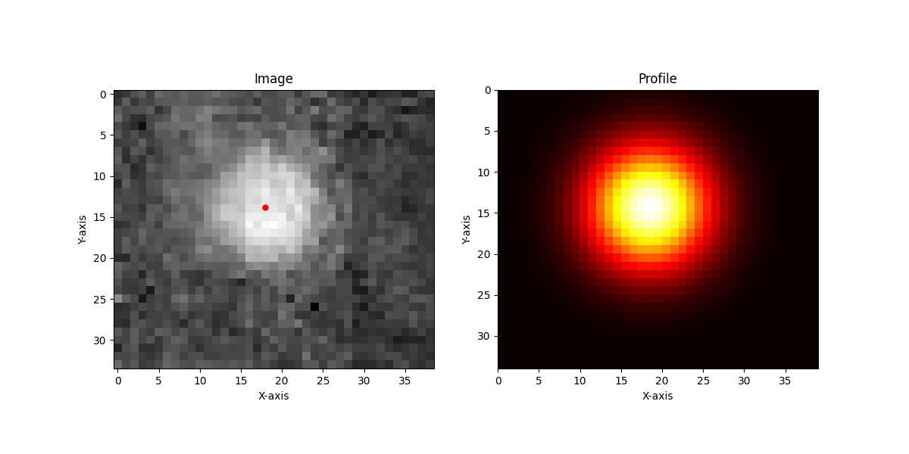

# LocalizeBead

This script fits a 2D Gaussian to a noisy image of a single bead using PyTorch optimization. It estimates:

- `x`, `y`: bead position  
- `d`: Gaussian width  
- `A`: amplitude  
- `b`: background  
- `sigma`: noise level

The model assumes Gaussian-distributed noise and minimizes the negative log-likelihood of the image.

---

## Example Output



---

## Usage

### Setup a virtual environment

**Linux/macOS:**
```bash
python3 -m venv .venv
source .venv/bin/activate
pip install -r requirements.txt
```
**Windows:**
```bash
python -m venv .venv
.\.venv\Scripts\activate
pip install -r requirements.txt
```

### Run the script

```bash
python localize_bead.py path/to/your/image.png
```

